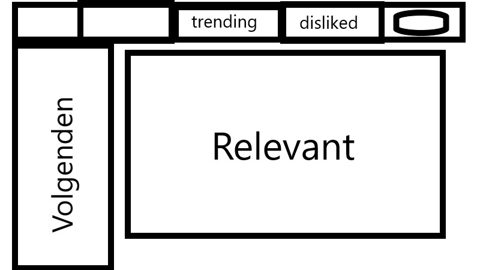
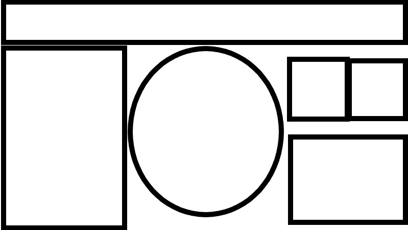

# Project voorstel
### Matthijs Vollenbroek, Sam Tegel, Thomas Cool, Tim Zwiers
## Samenvatting
We maken een sociale media site waarop foto’s en GIFs gedeeld kunnen worden. Je kan die posts liken en disliken. Er is een “hall of fame” tab met de meest gelikete foto’s en GIFs van die dag en een “hall of shame” met de meest gedislikete. Je moet mensen kunnen volgen. Alleen de meest gelikete post en de meeste gedislikete post van het profiel van de gebruiker blijven bestaan, de rest verdwijnt na 3 dagen.

## MVP Features:
-	Post liken en disliken
-	Hall of Fame en Hall of Shame
-	Mensen Volgen
-	Mensen opzoeken via zoekbalk
-	Registreren
-	Inloggen
-	Tekst bij post plaatsen als poster van afbeelding of GIF.
-	Sorteren op posts gemaakt door mensen die je volgt en mensen die je niet volgt
-	Profiel bekijken met de meest gelikete post van dat profiel en de meeste gedislikete (en eventuele posts die nog geen drie dagen oud zijn). 
## Optionele features:
-	Wachtwoord vergeten
-	Sorteren op afbeeldingen of Gifs
-	Privé en openbare posts
-	Profielfoto
-	Posts die na drie dagen blijven staan kunnen niet meer gelikete of gedislikete worden
-	Posts verdwijnen na drie dagen als ze niet meest gelikete of gedislikete zijn.
-	Degene met meest gelikete post krijgt kroontje bij zijn naam en degene met de meest gedislikete post krijgt poepemoji.
-	Posts opzoeken
## Databronnen:
API voor GIFs = http://api.giphy.com

## Afhankelijkheden:
Bootstrap voor ontwerp
phpliteadmin voor database

## Concurrerende sites:
-	Instagram, bij ons kan je ook disliken en posts verdwijnen. Een highscore om naar te streven.
-	Snapchat, bij ons heb je langer de tijd om een post te bekijken.

 
## Moeilijkste delen van de site:
-	Een wachtwoord vergeten functie, want dan moeten er een soort mailingservice opgezet worden.
-	Posts opzoeken, want je moet een manier van filteren bedenken die vrij lastig te maken is.
-	Posts verwijderen naar drie als ze niet meest gelikete/gedislikete zijn is wel lastig om te programmeren in database.
-	GIFs posten met API, hoe dat geprogrammeerd moet worden is nog niet helemaal duidelijk.

## Schetsen:

