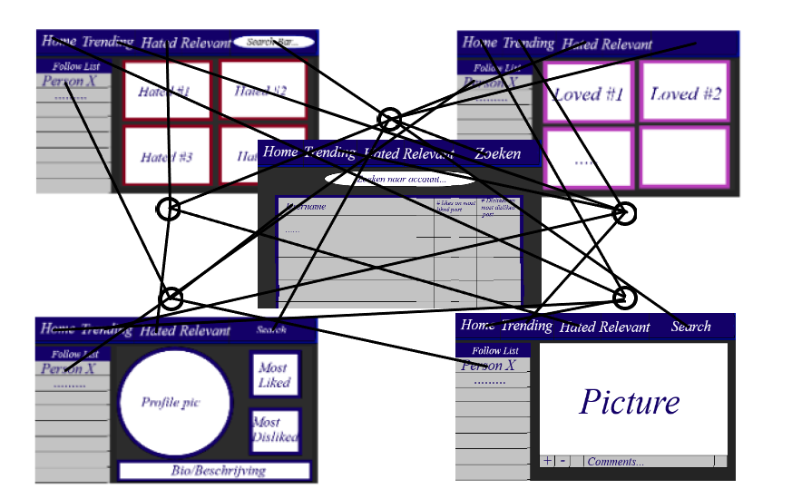

# Technisch ontwerp

## Controllers

### Alle routes voor de application.py:

@login (inlogscherm en startscherm van de site, registreerknop voor nieuwe gebruikers):
- POST en GET
- Checken of inlogvelden correct zijn ingevuld.
- Checken of gebruikersnaam en wachtwoord correct zijn.
- Opslaan dat user is ingelogd
- Redirecten naar homepage voor ingelogde persoon.

@register (registreren van nieuwe gebruikers, met bevestigingswachtwoord):
- POST en GET
- Check dat gebruikersnaam niet al in gebruik is.
- Check dat bevestigingswachtwoord overeenkomt met het wachtwoord.
- Opslaan dat user is ingelogd
- Redirecten naar homepage voor ingelogde persoon.

@logout (uitloggen):
- POST
- De opgeslagen user die is ingelogd verwijderen.
- Redirecten naar log-in scherm (startscherm).

@homepage (startscherm voor ingelogde gebruikers, met meest recente posts van mensen die user volgt):
- POST en GET
- Check dat ingelogd is (login_required)
- Ophalen 10 meest recente posts van accounts die gevolgd worden door user.
- Ophalen lijst met gevolgde accounts.

@homepage_recent (als op de knop voor meest recente posts wordt geklikt, moet de tijdlijn met posts veranderen):
- POST en GET
- login_required
- ophalen 10 meest recente posts van de dag
- ophalen lijst met gevolgde accounts
- redirecten naar recent-page

@homepage_trending (als op de knop trending (hall of fame) wordt geklikt, moet alleen de tijdlijn met posts veranderen):
- POST en GET
- Login_required
- Ophalen 10 meest gelikete posts van de dag.
- Ophalen lijst met gevolgde accounts.
- Redirecten naar trending-page

@homepage_hall_of_shame (als op de knop (hall of shame) wordt geklikt, moet alleen de tijdlijn met postst veranderen):
- POST en GET
- Login_required
- Ophalen 10 meest gedislikete posts van de dag.
- Ophalen lijst met gevolgde accounts.
- Redirecten naar hallofshame-page.

@post (foto of gif uploaden):
- POST en GET
- Login_required
- Uploaden foto of GIF naar database.
- Uploaden beschrijving naar database.
- redirect naar homepage voor ingelogde personen met melding succesvol geupload.

@profile (profielen bekijken):
- POST en GET
- login_required
- profielfoto, bio, aantal volgers en meest gelikete, meest gedislikete en posts max. 3 dagen oud van user van profiel ophalen.

@profile_user (eigen profiel):
- POST en GET
- bio uploaden, profielfoto uploaden naar database.
- ophalen gegevens profielfoto, aantal volgers, huidige bio en posts uit database.

@like (post liken):
- POST en GET
- Check dat post niet al geliked of gedisliked is door user.
- Updaten aantal likes van post, updaten likes van die dag op die post.
- Indien eerst dislike, dislike van post verwijderen.
- Geen page refresh (Script?)

@dislike (post disliken):
- POST en GET
- Check dat post niet al geliked of gedisliked is door user.
- Updaten aantal dislikes post, updaten dislikes van die dag op die post.
- Indien eerst like, like verwijderen van post.
- Geen page refresh (Script?)

@search (opzoeken profielen):
- POST
- Zoeken op profielnamen die de zoekterm bevatten.
- Inladen meest overeenkomende profielen (max. 5(?))
- Redirecten naar zoekresultatenpagina

@search_results (zoekresultaten):
- POST en GET
- Zoekresultaten van search gebruiken om data uit database op te halen (profielfoto, aantal volgers en bio)

## Models/helpers:

### Alle functies die vaak gebruikt worden in helpers.py:

- login_required (moet checken of persoon ingelogd is op een account)
- volger_lijst: ophalen van lijst gevolgde accounts voor de sidebar
- most_liked: ophalen welke post meest geliked is op account
- most_disliked: ophalen welke post meest gedisliked is op account
- profile_picture: inladen profielfoto
- load_posts: het inladen van de 10 posts (most liked, most disliked of most recent)

## Views:

## Plugins: 
- Bootstrap (layout maken).
- MD Bootstrap (tabel sort functie).
